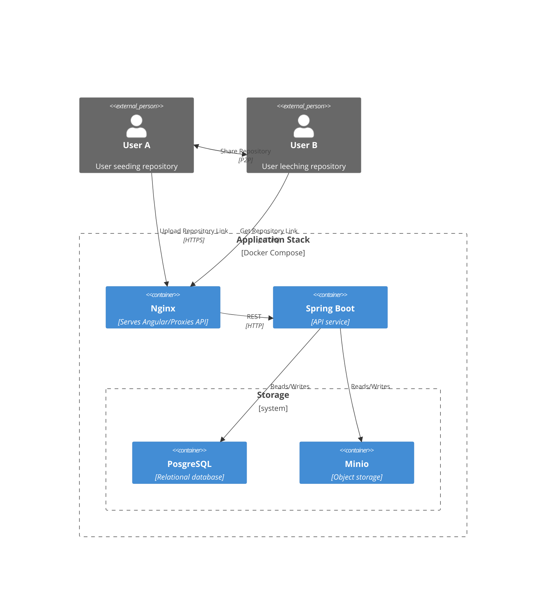

## Overview

The GitTor-Web application is hosted via Docker Compose to ensure a consistent runtime across various platforms.
Within the stack, there are several different containers with different purposes:

- **Nginx** Serves the Angular frontend and proxies all `/api/*` requests to the API. This is the only container visible to outside users through ports 80 and 443. *Certain sensitive api paths get blocked at this point*
- **Spring Boot** Implements all business logic, but does not have any state, instead relying on the storage systems for that.
- **PostgreSQL** Relational database for persistent storage of structured data such as users, permissions, etc.
- **Minio** Simple storage service for persistent storage of unstructured data such as user photos and other files.

## Development

It would be costly to have to run this entire architecture during development, so, along with not using Docker, some services get replaced with simpler alternatives at this stage:

- **PostgreSQL** -> **H2** Database is stored in a file or, for testing, in memory.
- **Minio** -> **Folder** Objects are stored as files in a folder or, for testing, in memory.
- **Nginx** -> **Angular** Angular has a built-in proxy system which replaces the proxy to the api.

There is also a development configuration for the Dockerized architecture, which publicly exposes all containers and creates an extra container that hosts a website for easily viewing the database.

## Frontend Architecture

### Top Level folders
Most if not all code should fall within one of these folders.
#### Core 🌎
- Contains app-wide services, singletons, and infrastructure.
- Never include components or UI code.
- All services are provided in the root.
#### Shared 🤝
- Contains reusable UI elements and utilities.
- Examples: components, pipes, directives.
- Code is always stateless.
#### Features 🚀
- Contains user-facing components and pages.
- Organize functionality into domains.
- Services are feature-specific and provided only within that feature.
#### Generated 🤖
- Contains auto-generated files from backend definitions.
